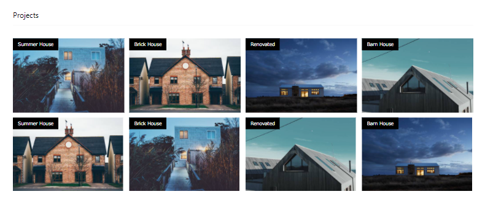
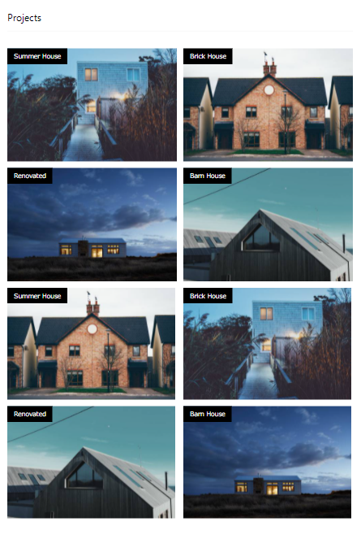
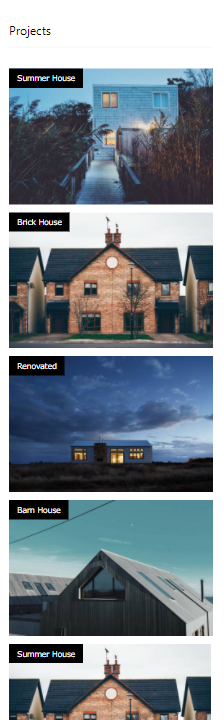

# Responsiveness Lab

## Overview
More than 50% of internet users surf the internet from their mobiles. This means that as a frontend developer you will need to cater to their devices screen sizes by adding responsiveness to your CSS styles.

## Instructions
This project is going to be divided into two parts where you will be working in pairs to get it done. First, you're going to create the page in the image below, then you are going to add responsive elements to it after the break. 

Please make sure that you switch roles after you come back from the break

The duration of each part of this lab is 30 mins for a total of 60 mins.

## Todo
- Create the layout you see in this image
- Add responsiveness for screen sizes with widths less than **(1024px)**
- Add responsiveness for screen sizes with widths less than **(600px)**